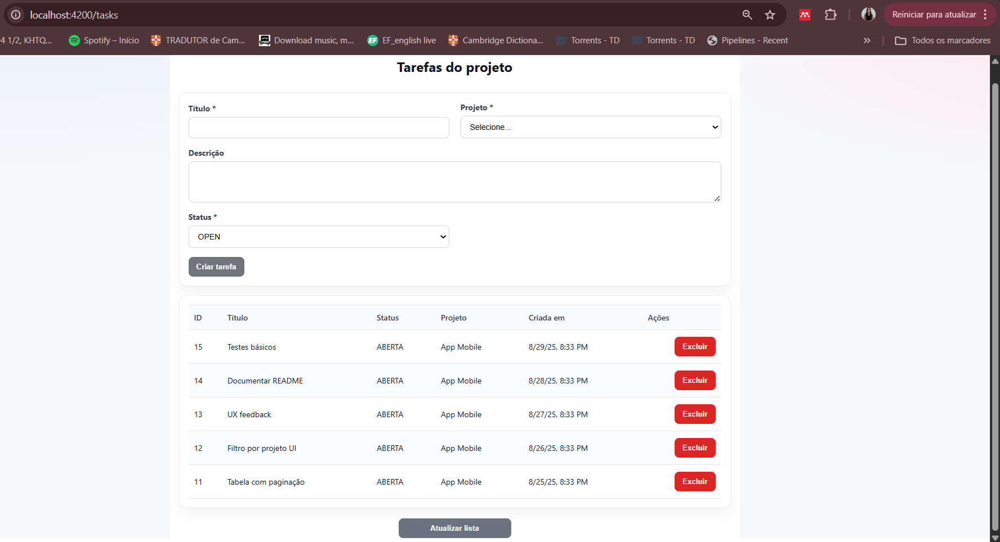
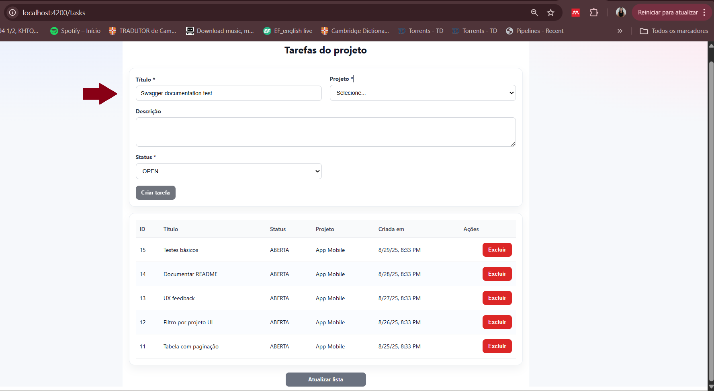
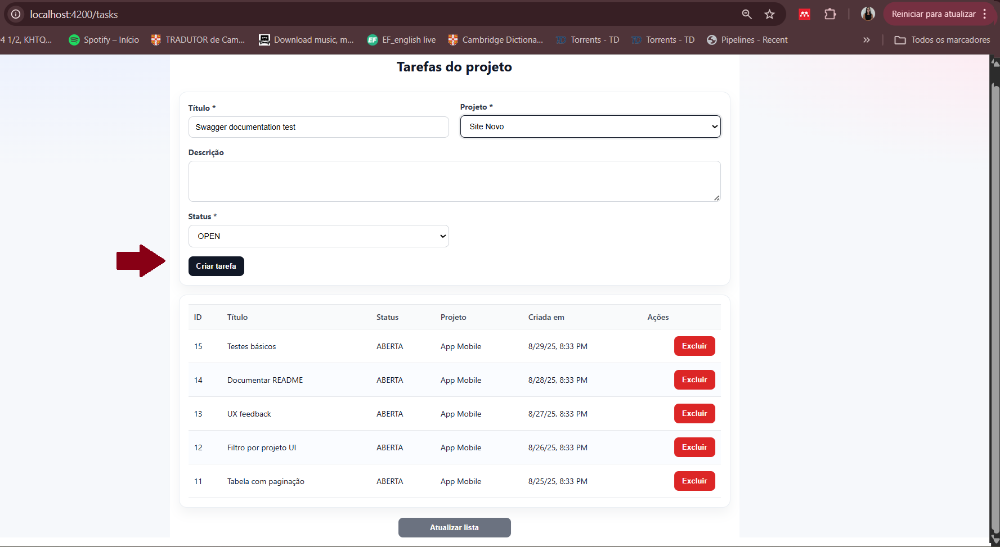
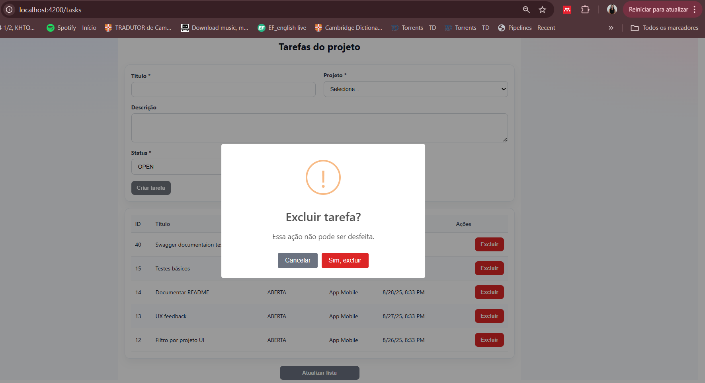
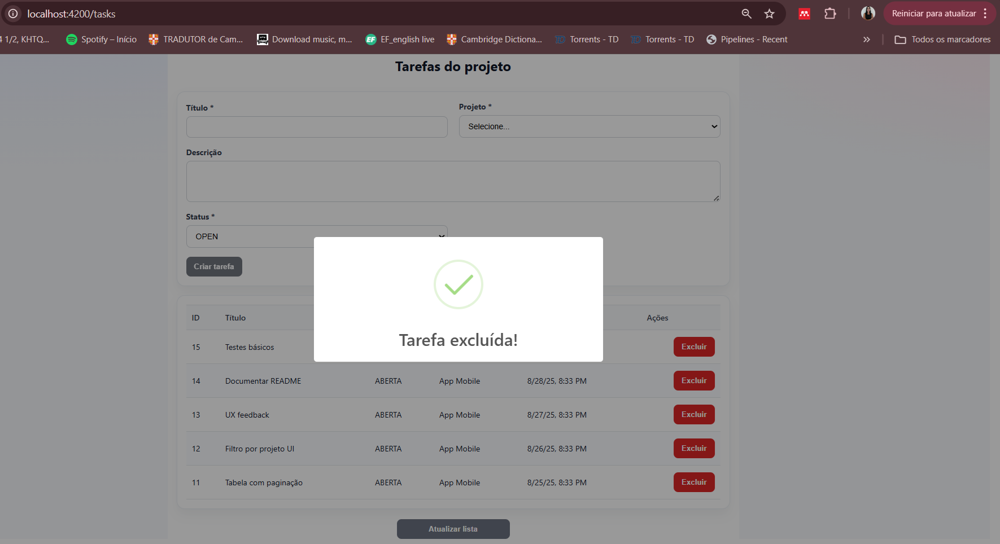

<p align="center">
  
  
</p>
<p align="center">
  
  
</p>

<h1 align="center"> Gestão de Tarefas - API Backend</h1>

<p align="center">
Aplicação para gerenciar tarefas e projetos. <b>Backend</b> em Java + Spring Boot e <b>Frontend</b> em Angular 17 (standalone).
</p>

---

## **Visão Geral**

O projeto permite criar, listar (com paginação, filtro por projeto e ordenação por data), atualizar e excluir **tarefas** associadas a um **projeto**.

- **Backend** expõe a API REST (H2 em memória com `MODE=DB2`, documentação Swagger).
- **Frontend** oferece a tela `/tasks` com listagem, formulário de criação, exclusão e seleção de projeto carregada da API.

---

## **Funcionalidades Implementadas**

### Backend (API)

- Estrutura **Spring Boot** (domain, dto, repository, service, controller).
- Entidades **Project** e **Task**.
- DTOs (`TaskRequest`, `TaskResponse`) para padronização da API.
- Serviço (`TaskService`) com regras de negócio.
- Endpoints REST:
  - `GET /tasks` → lista paginada (filtro opcional por `projectId`, ordenada por `createdAt` desc).
  - `POST /tasks` → cria tarefa (`@Valid`).
  - `PUT /tasks/{id}` → atualiza título/descrição/status/projeto.
  - `DELETE /tasks/{id}` → remove tarefa por ID.
  - `GET /tasks/projects` → lista todos os projetos.
- **Swagger / OpenAPI** para documentação e testes.
- **H2 em memória** com **modo DB2** para simular SQL e facilitar o desenvolvimento.
- Scripts `schema.sql` e `data.sql` para criação e carga inicial.

### Frontend (Angular)

- **Angular 17 (standalone)** com **HttpClient**.
- Rota **`/tasks`** com:
  - **listagem** (page/size padrão 0/5),
  - **formulário** para criar tarefa,
  - **botão** para excluir,
  - **select** de projetos carregado da API.
- **Proxy de desenvolvimento**: `/api` → `http://localhost:8080` para evitar CORS.

---

## **Tecnologias Utilizadas**

- **Java 17**
- **Spring Boot 3.5.5**
- **Spring Web / Spring Data JPA / Validation**
- **Hibernate**
- **Lombok**
- **H2 Database** (memória; `MODE=DB2`)
- **Maven**
- **Angular 17**, **TypeScript 5**, **RxJS 7**
- **Node 22+**

---

## **Estrutura do Projeto**

```bash
backend
┣ src/main/java/br/com/jennifer/backend
┃ ┣ controller/
┃ ┣ domain/
┃ ┣ dto/
┃ ┣ repository/
┃ ┗ service/
┣ src/main/resources
┃ ┣ application.properties
┃ ┣ schema.sql
┃ ┗ data.sql
┗ pom.xml

frontend
┣ src/app
┃ ┣ core/services/task.service.ts
┃ ┣ tasks/
┃ ┃ ┣ tasks.component.{ts,html,css}
┃ ┗ app.routes.ts
┣ src/environments
┃ ┣ environment.ts
┃ ┗ environment.prod.ts
┣ proxy.conf.json
┗ package.json


```

---

## **Como Rodar o Projeto**

### **1️ - Clonar o repositório**

```bash
git clone https://github.com/JenniferFariasRodrigues/gestao-tarefas.git
cd gestao-tarefas/backend
```

### **2 — Subir o Backend (Spring)**

```bash
$ cd backend
$ ./mvnw spring-boot:run
```

- **Swagger UI:** <http://localhost:8080/swagger-ui/index.html>
- **H2 Console:** <http://localhost:8080/h2-console>  
  **JDBC URL:** `jdbc:h2:mem:gestao;MODE=DB2;DATABASE_TO_UPPER=true`  
  **Usuário:** `sa` (sem senha)

### **3 — Subir o Frontend (Angular)**

Em outro terminal

```bash
$ cd ../frontend
$ npm install
$ npm start
```

- **Aplicação (UI):** <http://localhost:4200/tasks>
- **Requisito:** **Node 22+**

---

## Demonstração — Frontend (fluxo em imagens)

<p align="center">
  
  <br/><em>1) Tela inicial em <code>/tasks</code> com formulário e lista paginada.</em>
</p>

<p align="center">
  
  <br/><em>2) Validação: campos <strong>Título</strong> e seleção do projeto são obrigatórios.</em>
</p>

<p align="center">
  
  <br/><em>3) Seleção do <strong>Projeto</strong> carregado da API.</em>
</p>

<p align="center">
  
  <br/><em>4) Escolha do <strong>Status</strong> (OPEN / IN_PROGRESS / DONE).</em>
</p>

<p align="center">
  
  <br/><em>5) Formulário preenchido com botão <strong>Criar tarefa</strong> habilitado.</em>
</p>

<p align="center">
  
  <br/><em>6) Tarefa criada e exibida na tabela (projeto, status, data de criação).</em>
</p>

<p align="center">
  
  <br/><em>7) Ação <strong>Atualizar lista</strong> mostrando estado de carregamento.</em>
</p>

<p align="center">
  
  <br/><em>8) Confirmação de exclusão.</em>
</p>

<p align="center">
  
  <br/><em>9) Feedback de sucesso: tarefa excluída.</em>
</p>
Caso selecionado botão "Cancelar", volta para a página da figura 6.

---

## **Exemplos de Requisições (API)**

Listar tarefas (com paginação):

```bash
GET http://localhost:8080/tasks?page=0&size=5
```

Criar tarefa (JSON):

```bash
POST http://localhost:8080/tasks
Content-Type: application/json
{
"title": "Criar UI",
"description": "Implementar lista e formulário",
"status": "OPEN",
"projectId": 1
}
```

Deletar tarefa:

```bash
DELETE http://localhost:8080/tasks/{id}
```

Listar projetos:

```bash
GET http://localhost:8080/tasks/projects
```

---

---

## **Experiência Flex - parte 4**

<details>
  <summary>Material interno (Flex/ActionScript)</summary>

- [docs/FLEX_RESPOSTAS.md](docs/FLEX_RESPOSTAS.md)

</details>

---

## **Próximos Passos**

- Edição (PUT) pela interface.
- Paginação e filtro por projeto no frontend.
- Feedbacks (toasts) e validações visuais.
- Testes unitários (backend e frontend).
- Estilização responsiva (tema claro/escuro).

---

## **Licença**

Projeto desenvolvido para estudo e prática com Spring Boot e Angular.
Licença livre (MIT).

```

```
